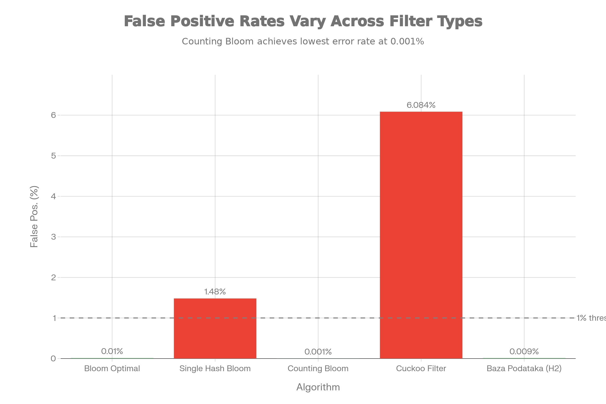

# Anti-Phishing Proxy Shield - Bloom Filter Demo

Ovo je demonstrativna aplikacija za detekciju malicioznih (phishing/malware) URL-ova koristeći **probabilističke strukture podataka**. Projekat demonstrira efikasnost Bloom filtera i njegovih varijacija u odnosu na klasične baze podataka.

## Ključne Funkcionalnosti

- **URL Proxy Check:** Brza provjera da li je URL siguran ili maliciozan.
- **Probabilistički Algoritmi:**
  - **Bloom Filter (Optimal):** Visoka preciznost i brzina.
  - **Bloom Filter (Single Hash):** Demonstracija loših performansi sa samo jednom hash funkcijom.
  - **Counting Bloom Filter:** Podrška za brisanje elemenata.
  - **Cuckoo Filter:** Alternativa Bloom filteru sa podrškom za brisanje.
- **Sveobuhvatni Benchmark:**
  - Testiranje na **100,000+ URL-ova** iz stvarnog `malicious_phish.csv` dataseta.
  - Mjerenje **False Positive Rate (FPR)**, brzine umetanja (insert) i pretrage (lookup).
  - Poređenje sa **H2 bazom podataka** (disk-based).

---

## Rezultati Benchmark-a

Aplikacija uključuje ugrađeni benchmark alat koji poredi performanse svih implementiranih struktura. Ovi rezultati su dobijeni na setu od 100k malicioznih i 100k benignih URL-ova:

### 1. Brzina Pretrage (Lookup Time)
Bloom filteri su **preko 150x brži** od relacione baze podataka!


*(Logaritamska skala)*

### 2. Preciznost (False Positive Rate)
Prikaz koliko često filter pogrešno označi siguran URL kao maliciozan.



| Algoritam | Brzina (Lookup) | False Positive % | False Negative % | Ocjena |
|-----------|----------------|------------------|------------------|--------|
| **Bloom Optimal** | **49 ms** | **0.01%** | 0.00% | ⭐⭐⭐⭐⭐ |
| **Bloom Single Hash** | 38 ms | 1.48% | 0.00% | ⭐ (Previše grešaka) |
| **Counting Bloom** | 52 ms | 0.001% | 0.00% | ⭐⭐⭐⭐ |
| **Cuckoo Filter** | **22 ms** | 6.08% | 0.37% | ⭐⭐ (Zahtijeva tuning) |
| **H2 Database** | 11487 ms | 0.009% | 0.00% | ⭐ (Sporo) |

> **Zaključak:** Optimalni Bloom filter nudi najbolji balans brzine i preciznosti, dok Single Hash varijanta jasno pokazuje zašto je upotreba više hash funkcija (k > 1) neophodna.

---

## Tehnologije

- **Backend:** Kotlin, Spring Boot 3
- **Baza:** H2 Database (In-Memory / Disk persistent)
- **Frontend:** HTML5, CSS3, JavaScript (Vanilla)
- **Algoritmi:** Custom implementacije Bloom, Counting Bloom i Cuckoo filtera (bez eksternih biblioteka za strukture).

## Instalacija i Pokretanje

### 1. Kloniranje repozitorijuma
```bash
git clone https://github.com/eminasirbubalo/BloomFilterProxyApp.git
cd BloomFilterProxyApp
```

### 2. Priprema Podataka
Osigurajte da imate `malicious_phish.csv` fajl u `src/main/resources/`. Aplikacija će pri pokretanju automatski učitati podatke u RAM (filtere) i bazu.

### 3. Pokretanje Aplikacije
Koristeći Gradle wrapper:
```bash
./gradlew bootRun
```

Aplikacija će biti dostupna na: `http://localhost:8080`

## Korištenje Aplikacije

1. Otvorite `http://localhost:8080` u browseru.
2. **URL Provjera:** Unesite sumnjivi URL (npr. `facebook.unitedcolleges.net`) i kliknite "Provjeri".
   - Ako je siguran: Bićete preusmjereni na taj URL.
   - Ako je maliciozan: Dobit ćete upozorenje "PRISTUP BLOKIRAN".
3. **Benchmark:** Kliknite na dugme **"POKRENI STRESS TEST"**. Sačekajte 10-20 sekundi da backend obradi 200k URL-ova i prikaže detaljnu tabelu performansi.

## Napomene o Implementaciji

- **Bloom Filter:** Koristi `BitSet` i kombinaciju `hashCode()` i `FNV1a` hash funkcija za simulaciju `k` nezavisnih hasheva.
- **Normalizacija:** Svi URL-ovi se normalizuju (lowercase, uklanjanje www/http) prije hashranja radi konzistentnosti.
- **Circular Dependency Fix:** `DataLoaderService` direktno puni bean-ove filtera kako bi se izbjegli problemi pri startovanju Spring konteksta.

---
*Autori: Emina Sirubalo i Armin Begic*
